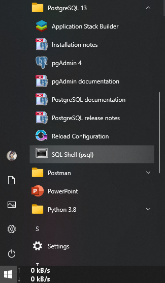
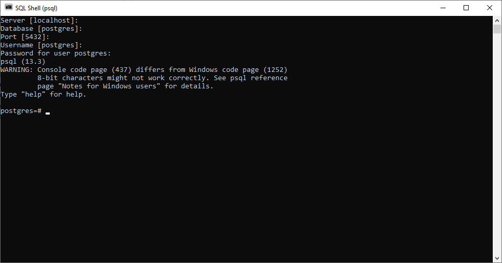
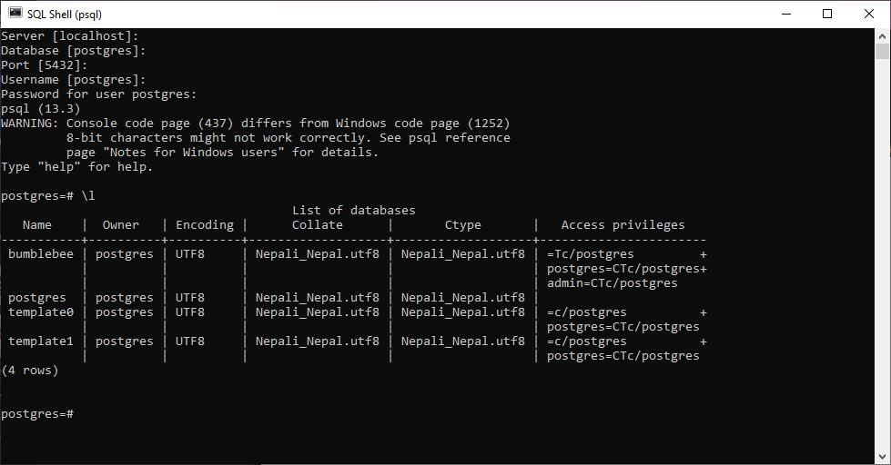

# scholarr-mobile-backend


Backend for scholarr mobile app

## Changelogs

Find the Changlogs @[docs/changelogs.md](docs/changelogs.md)

## Dependedencies

### **Main Dependencies**

* **Python 3.8**
* **pip** ( python default package manager)
* **poetry** ( Package and virtualenv manager | `pip install poetry`)
* **PostgreSQL** (database | *[Check docs for full setup process](docs/database_setup.md)*)

## Installation

### **MANUAL SETUP**

#### Setup a virtuial environment

* *install virtualenv using* `pip install virtualenv`

* *create a virtualenv in the repo base directory using* `virtualenv .venv`

#### Activate virtualenv

* Windows

```powershell
.venv\scripts\activate
```

* Linux

```BASH
source .venv/bin/activate
```

#### After all the mentioned dependencies are installed, run command

```python
python -m poetry install
```

This will install all the required dependencies for the project using the **poetry.lock** file which are needed for the projects.  
  
To check more dependencies enter command

```python
poetry show
```

## Setup Database

Open postgres terminal

### Windows

1. On windows, after installation of Postgres open the `SQL Shell (psql)` app. (You can find it on search menu)



2. Login to the shell by using default values (ie blanks) except the `password`. Use the password you had createed during postgres setup.



3. Run database script found @*[database sql script](scripts/database.sql)* by copying everthing into the postgres shell

4. Use `\l` command to check databases.



if `bumblebee` database appears, the database is set up.

### Linux

1. After installation, open postgres in terminal using

```BASH
   sudo -u postgres psql
   ```

This opens the postgres shell using user *postgres*.

2. Run database script found @*[database sql script](scripts/database.sql)* by copying everthing into the postgres shell

3. Use `\l` command to check databases.


if `bumblebee` database appears, the database is set up.

## Create Django Migrations

> **REMEMBER TO ACTIVATE VIRTUAL ENVIRONMENT**

In order to setup django app tables, migations must be made. it can be done simply by the commands

```BASH
python manage.py makemigrations
```

To apply migrations, use command.

```BASH
python manage.py migrate
```

Then the migrations should be applied and the database is ready.

> *Note sometimes migrations may not work, and in such cases makemigrations should explicitly mention the apps explicitly like*

```shell
python manage.py makemigrations activities, admin, auth, buzzes, comments, connections, contenttypes, feeds, notifications, profiles, sessions, token_blacklist, user
```
