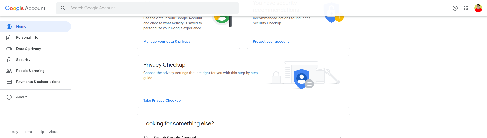
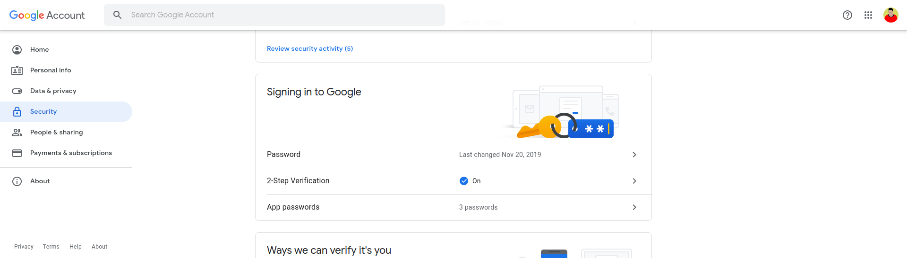
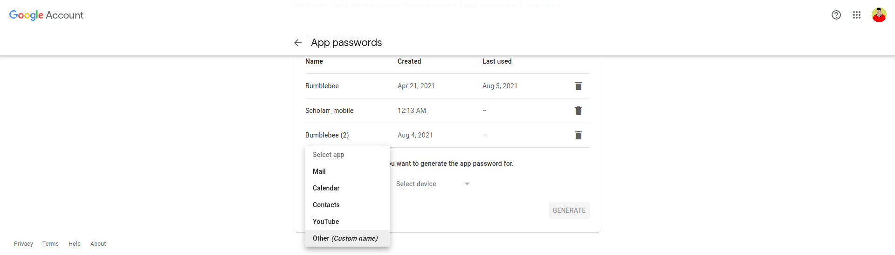

# Setting Up Google App Password

Inorder to setup google app passwords, follow the given steps:

1. Go to ***Google account settings*** at [google my accounts](https://myaccount.google.com),
   
   

2. Go to ***security tab*** and then to ***Signing in to google***. 
   
    

   ***Note: 2-step Verification must be on***

3. Select ***App Password*** and **create** a new app password.

    